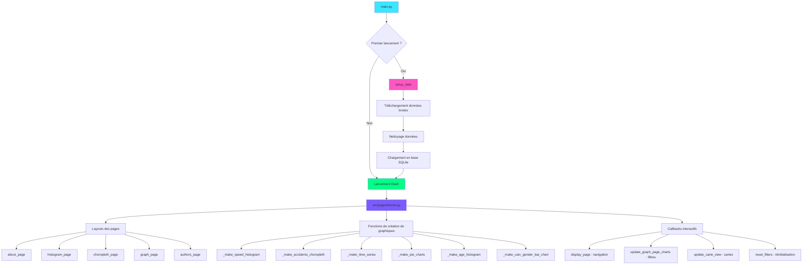

# Dashboard d'Accidentologie Routière en France

## Table des matières
- [User Guide](#user-guide)
- [Data](#data)
- [Developer Guide](#developer-guide)
- [Rapport d'analyse](#rapport-danalyse)
- [Copyright](#copyright)

---

## User Guide

### Prérequis

Avant de déployer le dashboard, vous devez avoir installé :
- **Python 3.11 ou supérieur**
- **pip** (gestionnaire de packages Python)

### Installation

1. **Cloner le dépôt depuis GitHub**
   ```bash
   git clone https://github.com/cleodetrez/Projet_data.git
   cd Projet_data
   ```

2. **Créer un environnement virtuel (recommandé)**
   ```bash
   python -m venv .venv
   ```

3. **Activer l'environnement virtuel**
   - Sous Windows :
     ```bash
     .venv\Scripts\activate
     ```
   - Sous Linux/Mac :
     ```bash
     source .venv/bin/activate
     ```

4. **Installer les dépendances**
   ```bash
   pip install -r requirements.txt
   ```

### Lancement du dashboard

Pour lancer le dashboard, exécutez simplement :
```bash
python main.py
```

Le dashboard sera accessible à l'adresse : **http://127.0.0.1:8050/**

Au premier lancement, le programme va automatiquement :
1. Télécharger les données brutes depuis data.gouv.fr
2. Nettoyer et structurer les données
3. Créer la base de données SQLite avec les tables nécessaires
4. Lancer le serveur web du dashboard

**Note** : Cette initialisation peut prendre quelques minutes lors du premier lancement. Certains fichiers csv sont très lourds.

### Utilisation du dashboard

Le dashboard est organisé en plusieurs pages accessibles via la barre de navigation en haut de l'écran.

#### Page "À propos"
Cette page présente le contexte du projet, les objectifs de l'analyse et les sources de données utilisées.

#### Page "Histogramme"
Cette page affiche la distribution des écarts de vitesse enregistrés par les radars automatiques en France. Lorsque l'on est à 0, alors l'usager roulait à la vitesse maximal autorisée sur la route, lorsque c'est négatif, l'usager roulait en dessous de la limitation de vitesse (resp positif, au dessus).

**Fonctionnalités :**
- Sélectionner l'année (2021 ou 2023)
- Observer la répartition des dépassements de vitesse par tranche

#### Page "Carte"
Visualisation géographique interactive des accidents sur le territoire français.

**Note** : Le chargement de la page lors de la séléction de commune peut prendre plusieurs secondes, la carte est très précise et donc très lourde.

**Fonctionnalités :**
- Choisir le niveau géographique : département, région ou commune
- Sélectionner l'année (2020 à 2024)
- Observer le nombre d'accidents par zone avec un code couleur (du vert au rouge)
- Survoler une zone pour voir les détails (nombre exact d'accidents et nom du département/région)

#### Page "Graphique"
Page principale d'analyse avec de nombreux graphiques interactifs et des filtres dynamiques.

**Filtres disponibles :**
- **Année** : 2020, 2021, 2022, 2023, 2024, ou toutes années confondues
- **Agglomération** : en agglomération / hors agglomération
- **Luminosité** : jour / crépuscule / nuit sans éclairage / nuit avec éclairage
- **Conditions atmosphériques** : normale / pluie légère / pluie forte / neige / brouillard / vent fort / temps éblouissant / temps couvert / autre
- **Sexe de l'usager** : homme / femme
- **Type de trajet** : domicile-travail / domicile-école / courses / promenade / loisir / professionnel / autre
- **Âge de l'usager** : âge minimum et maximum (l'utilisateur du dashboard choisit)
- **Catégorie de véhicule** : vélo / cyclo / voiture / VU / PL / transport en commun / train / tramway / 3 roues / EDP / autre
- **Type de motorisation** : thermique / électrique / hybride / hydrogène / GPL / autre

**Graphiques disponibles :**

1. **Série temporelle des accidents**
   - Visualisation : courbe d'évolution
   - Options : par heure, jour du mois, mois de l'année, ou jour de la semaine
   - Utilité : identifier les périodes à risque (heures de pointe, week-end, été)

2. **Répartition par sexe**
   - Visualisation : diagramme circulaire (camembert)
   - Montre la proportion homme/femme dans les accidents

3. **Répartition par catégorie de véhicule**
   - Visualisation : diagramme circulaire
   - Identifie les types de véhicules les plus impliqués

4. **Répartition par type de motorisation**
   - Visualisation : diagramme circulaire
   - Compare thermique, électrique, hybride, etc.

5. **Catégories de véhicules selon le sexe**
   - Visualisation : graphique en barres groupées
   - Croise le type de véhicule avec le sexe de l'usager

6. **Distribution par âge des victimes**
   - Visualisation : histogramme avec tranches d'âge colorées
   - Couleurs : vert (jeunes) → jaune → orange → rouge (seniors)
   - Permet d'identifier les tranches d'âge les plus à risque

#### Page "Auteurs"
Informations des auteurs du projet.


### Interactivité

Tous les graphiques sont interactifs grâce à Plotly :
- **Zoom** : utilisez la molette de la souris ou dessinez un rectangle
- **Déplacement** : cliquez-glissez pour déplacer la vue
- **Survol** : passez la souris sur les éléments pour voir les détails
- **Sélection** : cliquez sur les légendes pour afficher/masquer des séries
- **Export** : utilisez les boutons en haut à droite pour télécharger une image

Les filtres se mettent à jour en temps réel : modifiez un paramètre et tous les graphiques se recalculent instantanément.

### Structure des données stockées

- **Données brutes** : `data/raw/` (CSV téléchargés depuis data.gouv.fr)
- **Données nettoyées** : `data/cleaned/` (CSV traités et standardisés)
- **Base de données** : `bdd/database.db` (SQLite pour requêtes rapides) 

---

## Data

### Sources de données

Toutes les données utilisées dans ce projet proviennent de sources publiques officielles accessibles sur **data.gouv.fr**.

#### 1. Données d'accidents routiers (2020-2024)

**Source** : Base de données accidents corporels de la circulation routière  
**URL** : https://www.data.gouv.fr/fr/datasets/bases-de-donnees-annuelles-des-accidents-corporels-de-la-circulation-routiere-annees-de-2005-a-2023/  
**Format** : CSV  
**Mise à jour** : Annuelle  

**Contenu** : La base contient trois types de fichiers par année :
- **Caractéristiques** : informations générales sur chaque accident (date, heure, localisation, conditions météo, luminosité)
- **Usagers** : données sur les personnes impliquées (âge, sexe, gravité des blessures, type de trajet)
- **Véhicules** : informations sur les véhicules impliqués (catégorie, motorisation, manœuvre effectuée)

**Période couverte** : 2020 à 2024

#### 2. Données des radars automatiques

**Source** : Contrôles radars - écarts de vitesse relevés  
**URL** : https://www.data.gouv.fr/fr/datasets/radars-automatiques-controles-et-flashs/  
**Format** : CSV  
**Contenu** : Nombre de contrôles effectués, nombre de flashs, distribution des écarts de vitesse par tranche  
**Années disponibles** : 2021 et 2023

#### 3. Données géographiques

**Source** : Contours géographiques des communes, départements et régions françaises  
**URL** : https://github.com/gregoiredavid/france-geojson  
**Format** : GeoJSON  
**Contenu** : Polygones des frontières administratives pour créer les cartes interactives

### Description des données

#### Propriétés des datasets

**Nombre d'observations :**
- Environ **60 000 accidents** enregistrés par an (2020-2024)
- Total sur 5 ans : **~300 000 accidents**
- Usagers impliqués : **plus de 400 000 enregistrements**
- Observations radars : **plusieurs millions de contrôles**

**Variables numériques :**
- Latitude et longitude (coordonnées GPS précises)
- Âge des usagers
- Heure, jour, mois (temporalité)
- Codes numériques pour les variables catégorielles

**Géolocalisation :**
- Coordonnées GPS pour chaque accident
- Code département (2 chiffres)
- Code commune INSEE (5 chiffres)
- Permet la visualisation sur cartes choroplèthes interactives

#### Structure des fichiers

**Données brutes** (`data/raw/`) :
Les fichiers téléchargés depuis data.gouv.fr sont stockés sans modification pour garantir la traçabilité :
- `caracteristiques-YYYY.csv`
- `usagers-YYYY.csv`
- `vehicules-YYYY.csv`
- `radars-YYYY.csv`

**Données nettoyées** (`data/cleaned/`) :
Les données sont traitées, standardisées et sauvegardées dans des fichiers CSV propres :
- `caract_clean_YYYY.csv`
- `usager_clean_YYYY.csv`
- `vehicule_clean_YYYY.csv` (2020-2023 uniquement, pas disponible pour 2024)
- `radars_delta_clean_YYYY.csv`

**Base de données** (`bdd/database.db`) :
Une base SQLite est créée automatiquement au premier lancement. Elle contient :
- Tables individuelles par année et par type de données
- Tables jointes (`caract_usager_vehicule_YYYY`) qui fusionnent caractéristiques, usagers et véhicules pour faciliter les analyses
- Indexation pour optimiser les performances des requêtes

### Transformations appliquées

#### Scripts de nettoyage des caractéristiques d'accidents

**Fichiers** : `src/utils/clean_caract_YYYY.py` (un par année)

**Opérations effectuées :**
1. Chargement du CSV brut depuis `data/raw/`
2. Sélection des colonnes pertinentes
3. Renommage en colonnes standardisées
4. Création d'un identifiant unique `acc_id` (combinaison année + numéro accident)
5. Conversion des coordonnées GPS en format numérique
6. Gestion des valeurs manquantes
7. Suppression des doublons
8. Sauvegarde dans `data/cleaned/`

**Colonnes standardisées** :
- `acc_id` : identifiant unique
- `annee`, `mois`, `jour`, `heure` : temporalité
- `lat`, `lon` : coordonnées GPS
- `dep`, `com` : codes géographiques
- `agg` : en/hors agglomération
- `lum` : luminosité
- `atm` : conditions atmosphériques

#### Scripts de nettoyage des usagers

**Fichiers** : `src/utils/clean_usager_YYYY.py`

**Opérations effectuées :**
1. Standardisation des identifiants pour jointure avec caractéristiques
2. Nettoyage des données d'âge (année de naissance)
3. Codage des variables catégorielles (sexe, catégorie usager, trajet)
4. Gestion des valeurs aberrantes

**Colonnes standardisées** :
- `acc_id` : identifiant pour jointure
- `num_veh` : numéro de véhicule
- `sexe`, `an_nais` : démographie
- `catu` : catégorie usager (conducteur, passager, piéton)
- `trajet` : type de déplacement
- `secu` : équipement de sécurité

#### Scripts de nettoyage des véhicules

**Fichiers** : `src/utils/clean_vehicule_YYYY.py`

**Opérations effectuées :**
1. Standardisation des identifiants
2. Nettoyage des catégories de véhicules
3. Extraction des informations sur la motorisation
4. Codage des manœuvres et obstacles

**Colonnes standardisées** :
- `acc_id`, `num_veh` : identifiants
- `catv` : catégorie de véhicule
- `motor` : type de motorisation
- `obs`, `obsm`, `choc`, `manv` : circonstances de l'accident

**Note** : Les données véhicules ne sont pas disponibles pour 2024 sur data.gouv.fr.

#### Scripts de nettoyage des radars

**Fichiers** : `src/utils/clean_radars_YYYY.py`

**Opérations effectuées :**
1. Extraction et nettoyage des distributions d'écarts de vitesse
2. Conversion en format long (une ligne par tranche de vitesse)
3. Calcul des proportions et statistiques

**Sortie** : Distribution des dépassements de vitesse par tranche (0-5 km/h, 5-10 km/h, ..., >50 km/h)

### Chargement en base de données

**Script** : `load_to_db.py`

**Fonctionnalités :**
1. Création automatique de la base SQLite
2. Import de tous les CSV nettoyés dans des tables séparées
3. Création de tables jointes par jointure SQL :
   - `caract_usager_vehicule_YYYY` : fusion complète pour chaque année (2020-2023)
   - `caract_usager_2024` : fusion partielle pour 2024 (sans véhicules)
4. Création d'index sur les colonnes clés pour optimiser les performances
5. Gestion des cas spéciaux (années sans données véhicules)

**Avantages de la base SQLite :**
- Requêtes SQL rapides pour filtrer et agréger les données
- Pas besoin de charger tous les CSV en mémoire à chaque fois
- Facilite les jointures complexes entre caractéristiques, usagers et véhicules
- Permet des analyses multi-années efficaces

---

## Developer Guide

### Architecture du projet

Le projet est structuré de manière modulaire pour faciliter la maintenance et l'évolution du code.

```
Projet_data/
├── .gitignore                       # Fichiers à ignorer par git
├── main.py                          # Point d'entrée principal
├── config.py                        # Configuration (chemins, constantes)
├── load_to_db.py                    # Chargement CSV → SQLite
├── requirements.txt                 # Dépendances Python
├── README.md                        # Documentation
│
├── assets/
│   └── style.css                    # Styles CSS personnalisés (thème sombre néon)
│
├── bdd/
│   └── database.db                  # Base de données SQLite (générée au 1er lancement)
│
├── data/
│   ├── raw/                         # Données brutes téléchargées
│   │   ├── caracteristiques-YYYY.csv
│   │   ├── usagers-YYYY.csv
│   │   ├── vehicules-YYYY.csv
│   │   └── radars-YYYY.csv
│   │
│   └── cleaned/                     # Données nettoyées
│       ├── caract_clean_YYYY.csv
│       ├── usager_clean_YYYY.csv
│       ├── vehicule_clean_YYYY.csv
│       └── radars_delta_clean_YYYY.csv
│
├── src/
│   ├── __init__.py
│   │
│   ├── components/                  # Composants réutilisables (réservé pour l'avenir)
│   │   └── __init__.py
│   │
│   ├── pages/                       # Pages du dashboard
│   │   ├── __init__.py
│   │   └── home.py                  # Page unique contenant tous les layouts et callbacks
│   │
│   └── utils/                       # Fonctions utilitaires
│       ├── __init__.py
│       ├── get_data.py              # Téléchargement des données depuis data.gouv.fr
│       ├── clean_caract_YYYY.py     # Nettoyage caractéristiques (un fichier par année)
│       ├── clean_usager_YYYY.py     # Nettoyage usagers
│       ├── clean_vehicule_YYYY.py   # Nettoyage véhicules
│       ├── clean_radars_YYYY.py     # Nettoyage radars
│       ├── merge_data.py            # Fusion de données (non utilisé actuellement)
│       ├── common_functions.py      # Fonctions communes
│       └── transform_arrondissement.py  # Gestion des arrondissements
│
├── communes.geojson                 # Contours géographiques des communes
├── departements-version-simplifiee.geojson
├── regions-version-simplifiee.geojson
│
├── inspect_geojson.py               # Script d'inspection des fichiers GeoJSON
└── transform_arrondissement.py      # Script de transformation des arrondissements
```

### Diagramme d'architecture (Mermaid)

Le projet suit une architecture de **programmation impérative** structurée en fonctions.



### Composants principaux

#### 1. `main.py` - Point d'entrée de l'application

**Rôle** : Orchestrer le setup des données et lancer le serveur Dash

**Fonction principale** : `setup_data()`
- Vérifie si les données nettoyées existent déjà
- Si nécessaire, télécharge les CSV bruts depuis data.gouv.fr
- Nettoie les données avec les scripts appropriés
- Charge tout dans SQLite via `load_to_db.py`
- Gère les rechargements en mode debug (évite de tout recharger à chaque fois)

**Flux d'exécution** :
```python
if __name__ == "__main__":
    # 1. Vérifier si c'est un reload de debug ou un vrai lancement
    werkzeug_run = os.environ.get("WERKZEUG_RUN_MAIN")
    
    # 2. Setup données uniquement au premier lancement
    if werkzeug_run != "true":
        setup_data()
    
    # 3. Lancer le serveur Dash sur port 8050
    app.run(debug=True, port=8050)
```

#### 2. `src/utils/get_data.py` - Téléchargement des données

**Rôle** : Télécharger les fichiers CSV depuis data.gouv.fr

**Fonctions principales** :
- `get_caract_YYYY()` : télécharge les caractéristiques d'accidents pour une année
- `get_usager_YYYY()` : télécharge les données usagers
- `get_vehicule_YYYY()` : télécharge les données véhicules
- `get_radar_YYYY()` : télécharge les statistiques radars

**Exemple d'utilisation** :
```python
from src.utils.get_data import get_caract_2023
get_caract_2023()  # Télécharge dans data/raw/caracteristiques-2023.csv
```

#### 3. Scripts de nettoyage (`src/utils/clean_*.py`)

**Rôle** : Nettoyer, standardiser et valider les données

**Pattern général** :
```python
def clean_caracteristiques():
    """Nettoie le fichier caracteristiques-YYYY.csv."""
    # 1. Chargement
    input_path = ROOT / "data" / "raw" / f"caracteristiques-{YEAR}.csv"
    df = pd.read_csv(input_path, sep=";", low_memory=False, encoding="latin-1")
    
    # 2. Sélection et renommage des colonnes
    df = df[["Num_Acc", "an", "mois", "jour", "heure", "lat", "long", ...]]
    df.columns = ["num_acc", "annee", "mois", "jour", "heure", "lat", "lon", ...]
    
    # 3. Création d'un identifiant unique
    df["acc_id"] = df["annee"].astype(str) + "_" + df["num_acc"].astype(str)
    
    # 4. Nettoyage des valeurs
    df = df.dropna(subset=["lat", "lon"])
    df["lat"] = pd.to_numeric(df["lat"], errors="coerce")
    df["lon"] = pd.to_numeric(df["lon"], errors="coerce")
    
    # 5. Suppression des doublons
    df = df.drop_duplicates(subset=["acc_id"])
    
    # 6. Sauvegarde
    output_path = ROOT / "data" / "cleaned" / f"caract_clean_{YEAR}.csv"
    df.to_csv(output_path, index=False, sep=",")
    print(f"✓ {output_path.name} créé avec {len(df)} lignes")
```

**Colonnes standardisées** :

| Type | Colonnes |
|------|----------|
| Caractéristiques | `acc_id`, `annee`, `mois`, `jour`, `heure`, `lat`, `lon`, `dep`, `com`, `agg`, `lum`, `atm` |
| Usagers | `acc_id`, `num_veh`, `place`, `catu`, `sexe`, `an_nais`, `trajet`, `secu`, `locp`, `actp`, `etatp` |
| Véhicules | `acc_id`, `num_veh`, `catv`, `occutc`, `obs`, `obsm`, `choc`, `manv`, `motor` |

#### 4. `load_to_db.py` - Création de la base de données

**Rôle** : Charger tous les CSV nettoyés dans une base SQLite et créer des tables jointes

**Fonctionnalités** :
1. Crée les tables individuelles par année (`caract_YYYY`, `usager_YYYY`, `vehicule_YYYY`)
2. Effectue des jointures SQL pour créer `caract_usager_vehicule_YYYY`
3. Gère le cas spécial de 2024 (pas de données véhicules disponibles)
4. Indexe les colonnes clés pour optimiser les requêtes

**Exemple de jointure** :
```sql
CREATE TABLE caract_usager_vehicule_2023 AS
SELECT c.*, u.*, v.*
FROM caract_2023 c
LEFT JOIN usager_2023 u ON c.acc_id = u.acc_id
LEFT JOIN vehicule_2023 v ON c.acc_id = v.acc_id AND u.num_veh = v.num_veh
```

#### 5. `src/pages/home.py` - Cœur de l'application Dash

**Rôle** : Contient tous les layouts, graphiques et callbacks du dashboard

**Structure** :
- **Layouts des pages** : `about_page`, `histogram_page`, `choropleth_page`, `graph_page`, `authors_page`
- **Fonctions de création de graphiques** : génèrent les figures Plotly
- **Callbacks** : gèrent l'interactivité et la navigation
- **Fonction utilitaire** : `query_db()` pour exécuter des requêtes SQL

**Fonctions de création de graphiques** :

| Fonction | Description | Type Plotly |
|----------|-------------|-------------|
| `_make_speed_histogram()` | Distribution des écarts de vitesse radars | `go.Bar` |
| `_make_accidents_choropleth()` | Carte choroplèthe des accidents | `go.Choroplethmapbox` |
| `_make_time_series()` | Évolution temporelle des accidents | `go.Scatter` |
| `_make_accidents_pie_chart()` | Répartition par sexe | `go.Pie` |
| `_make_catv_pie_chart()` | Répartition par catégorie véhicule | `go.Pie` |
| `_make_motor_pie_chart()` | Répartition par motorisation | `go.Pie` |
| `_make_catv_gender_bar_chart()` | Véhicules par sexe | `go.Bar` (groupées) |
| `_make_age_histogram()` | Distribution par âge | `go.Bar` (colorées) |

**Callbacks principaux** :

| Callback | Inputs | Outputs | Rôle |
|----------|--------|---------|------|
| `display_page()` | Clics sur boutons navbar | `page-content` | Navigation entre pages |
| `update_graph_page_charts()` | Tous les filtres | Tous les graphiques | Mise à jour dynamique |
| `update_carte_view()` | Boutons mode/année carte | `page-content` | Changement de vue géographique |
| `reset_filters()` | Bouton reset | Valeurs des filtres | Réinitialisation |

### Comment ajouter une nouvelle page

**Étape 1** : Créer le layout dans `src/pages/home.py`
```python
nouvelle_page = html.Div([
    html.H2("Titre de ma page", className="page-title"),
    html.Div([
        html.P("Description de ma page"),
        dcc.Graph(id="mon-nouveau-graphique")
    ], className="page-card")
], className="page-container")
```

**Étape 2** : Ajouter un bouton dans la navbar
```python
navbar = html.Div([
    # ... boutons existants ...
    html.Button("Ma Page", id="btn-ma-page", className="nav-button"),
], className="navbar")
```

**Étape 3** : Mettre à jour le callback de navigation
```python
@callback(
    Output("page-content", "children"),
    [
        Input("btn-about", "n_clicks"),
        # ... autres inputs ...
        Input("btn-ma-page", "n_clicks"),
    ],
    prevent_initial_call=True
)
def display_page(_about, ..., _ma_page):
    ctx = callback_context
    if not ctx.triggered:
        return about_page
    
    button_id = ctx.triggered[0]["prop_id"].split(".")[0]
    
    mapping = {
        "btn-about": about_page,
        # ... autres mappings ...
        "btn-ma-page": nouvelle_page,
    }
    
    return mapping.get(button_id, about_page)
```

### Comment ajouter un nouveau graphique

**Étape 1** : Créer la fonction de génération
```python
def _make_mon_nouveau_graphique(year=2023, filtre1=None):
    """
    Génère un graphique illustrant [description].
    
    Args:
        year: Année des données (2020-2024)
        filtre1: Filtre optionnel
    
    Returns:
        plotly.graph_objects.Figure
    """
    try:
        # 1. Récupérer les données
        sql = """
        SELECT col1, COUNT(*) as count
        FROM caract_usager_vehicule_{year}
        WHERE condition = :param
        GROUP BY col1
        """.format(year=year)
        
        df = query_db(sql, {"param": filtre1})
        
        # 2. Créer la figure
        fig = go.Figure()
        fig.add_trace(go.Bar(
            x=df["col1"],
            y=df["count"],
            marker={"color": "#3ae7ff"}
        ))
        
        # 3. Styliser
        fig.update_layout(
            title="Mon nouveau graphique",
            xaxis_title="Axe X",
            yaxis_title="Nombre d'accidents",
            paper_bgcolor="#1a1d2e",
            plot_bgcolor="#1a1d2e",
            font={"color": "#e6e9f2", "size": 12}
        )
        
        return fig
        
    except Exception as err:
        # Gestion d'erreur
        fig = go.Figure()
        fig.add_annotation(
            text=f"Erreur : {err}",
            showarrow=False,
            font={"size": 14, "color": "#ff6b6b"}
        )
        return fig
```

**Étape 2** : Ajouter au layout de la page graphique
```python
graph_page = html.Div([
    # ... graphiques existants ...
    html.Div([
        html.H3("Mon nouveau graphique"),
        dcc.Graph(id="mon-nouveau-graphique")
    ], className="page-card")
])
```

**Étape 3** : Mettre à jour le callback
```python
@callback(
    [
        Output("time-series", "figure"),
        # ... autres outputs ...
        Output("mon-nouveau-graphique", "figure"),
    ],
    [
        Input("year-dropdown", "value"),
        # ... autres inputs ...
    ]
)
def update_graph_page_charts(year, ...):
    return (
        _make_time_series(year, ...),
        # ... autres graphiques ...
        _make_mon_nouveau_graphique(year, filtre1),
    )
```

### Code actuel

1. **Nommage explicite** : Variables et fonctions ont des noms descriptifs en français
2. **Docstrings** : Chaque fonction importante documente ses paramètres et sa sortie
3. **Gestion d'erreurs** : Try/except pour éviter les crashs et afficher des messages clairs
4. **Séparation des responsabilités** : Chaque module a un rôle bien défini
5. **Réutilisabilité** : Fonctions paramétrables pour différents cas d'usage
6. **Constantes** : Utilisation de `config.py` pour les chemins et valeurs partagées

### Technologies utilisées

- **Python 3.12** : Langage de programmation
- **Dash 2.14** : Framework web interactif basé sur Flask et React
- **Plotly 5.18** : Bibliothèque de visualisation graphique
- **Pandas 2.0** : Manipulation et analyse de données
- **SQLAlchemy 2.0** : ORM et gestion de base de données
- **SQLite 3** : Base de données légère et sans serveur
- **Requests** : Téléchargement de fichiers HTTP
- **GeoPandas** : Manipulation de données géographiques

---

## Rapport d'analyse

### Contexte et objectifs

L'accidentologie routière représente un enjeu majeur de santé publique en France. Chaque année, les accidents de la route causent des milliers de victimes et des coûts humains et économiques considérables. Ce dashboard a pour objectif d'analyser en profondeur les données d'accidents sur la période 2020-2024 pour identifier les facteurs de risque et les tendances, dans le but d'éclairer les politiques de prévention.

### Méthodologie

1. **Collecte** : Données officielles de data.gouv.fr (accidents corporels déclarés)
2. **Nettoyage** : Standardisation, suppression des anomalies, gestion des valeurs manquantes
3. **Structuration** : Base de données SQLite avec tables jointes pour analyses croisées
4. **Visualisation** : Dashboard interactif Dash + Plotly avec filtres dynamiques
5. **Analyse** : Exploration temporelle, géographique, démographique et comportementale


### Exemple d'utilisation du dashboard

Sur la base des analyses découlantes du dashboard, plusieurs axes d'amélioration peuvent être proposés :

1. **Prévention ciblée** : 
   - Campagnes spécifiques pour les 18-24 ans (permis probatoire renforcé, formation post-permis)
   - Sensibilisation aux risques spécifiques des conducteurs masculins
   
2. **Infrastructure** :
   - Extension et entretien de l'éclairage public sur les axes à risque
   - Aménagement des points noirs identifiés par l'analyse géographique
   - Zones 30 et plateaux surélevés en ville
   
3. **Sensibilisation météo** :
   - Rappels sur l'adaptation de la conduite aux conditions (pluie, brouillard)
   - Information en temps réel sur les conditions dangereuses
   
4. **Protection des usagers vulnérables** :
   - Pistes cyclables séparées et continues
   - Passages piétons sécurisés (îlots refuges, feux adaptés)
   - Zones de rencontre à 20 km/h
   
5. **Contrôles renforcés** :
   - Maintien et extension du réseau de radars automatiques
   - Contrôles mobiles aux heures critiques (vendredi/samedi soir, heures de pointe)
   - Lutte contre l'alcool au volant (éthylotests anti-démarrage)
   
6. **Éducation routière** :
   - Renforcement de la formation initiale (situations d'urgence, conduite de nuit)
   - Formation continue obligatoire tous les 10-15 ans
   - Bilans de santé pour les conducteurs seniors

### Limites de l'étude et perspectives d'amélioration du dashboard

Il convient de souligner certaines limites méthodologiques :

- **Données déclarées uniquement** : Seuls les accidents corporels faisant l'objet d'un procès-verbal sont inclus. Les accidents matériels légers ne sont pas comptabilisés.
- **Données 2024 incomplètes** : Les données véhicules ne sont pas disponibles sur data.gouv.fr pour 2024.
- **Gravité non détaillée** : Ce dashboard ne distingue pas finement les blessés légers, hospitalisés et tués. Une analyse de la gravité serait un complément pertinent.
- **Facteurs comportementaux limités** : Les données sur l'alcoolémie, les stupéfiants ou la fatigue ne sont pas systématiquement renseignées.
- **Exposition au risque non mesurée** : L'analyse ne tient pas compte du trafic réel (kilomètres parcourus par type d'usager), ce qui empêche de calculer des taux d'accidents précis.

### Conclusion

Ce dashboard démontre l'apport de l'analyse de données pour éclairer les politiques publiques de sécurité routière. Les données révèlent des patterns clairs (temporels, géographiques, démographiques) qui doivent guider les actions de prévention. Une approche ciblée, adaptée aux spécificités de chaque population et contexte, est nécessaire pour réduire efficacement le nombre et la gravité des accidents de la route en France.

---

## Copyright

### Déclaration d'originalité

Je déclare sur l'honneur que le code fourni a été produit par nous-mêmes, à l'exception des éléments listés ci-dessous.

### Données utilisées

Les données proviennent de sources publiques officielles :

1. **Accidents corporels de la circulation routière (2020-2024)**
   - Source : [data.gouv.fr - Base accidents](https://www.data.gouv.fr/fr/datasets/bases-de-donnees-annuelles-des-accidents-corporels-de-la-circulation-routiere-annees-de-2005-a-2023/)
   - Licence : Licence Ouverte / Open Licence (ODbL)
   - Auteur : Ministère de l'Intérieur / ONISR

2. **Radars automatiques (2021, 2023)**
   - Source : [data.gouv.fr - Radars](https://www.data.gouv.fr/fr/datasets/radars-automatiques-controles-et-flashs/)
   - Licence : Licence Ouverte / Open Licence (ODbL)
   - Auteur : Ministère de l'Intérieur

3. **Contours géographiques (communes, départements, régions)**
   - Source : [GitHub - france-geojson](https://github.com/gregoiredavid/france-geojson/)
   - Auteur : Grégoire David
   - Licence : MIT License

### Code emprunté ou inspiré

| Fichier / Lignes | Source | Explication |
|------------------|--------|-------------|
| `main.py` (lignes 1-30) | [Documentation Dash](https://dash.plotly.com/devtools) | Structure standard d'initialisation d'une application Dash avec `app = Dash(__name__)` et configuration du serveur |
| `src/pages/home.py` (chargement GeoJSON, lignes 20-30) | [Documentation Plotly Mapbox](https://plotly.com/python/mapbox-county-choropleth/) | Utilisation de `json.load()` pour charger les fichiers GeoJSON et les passer à `go.Choroplethmapbox` |
| `src/utils/get_data.py` (téléchargement HTTP) | [Documentation requests](https://docs.python-requests.org/en/latest/user/quickstart/) | Pattern standard `requests.get(url)` puis écriture du contenu avec `open(file, 'wb').write(r.content)` |
| `load_to_db.py` (SQLAlchemy) | [Documentation SQLAlchemy](https://docs.sqlalchemy.org/en/20/core/engines.html) | Syntaxe `create_engine("sqlite:///...")` pour créer une connexion à la base de données et `pd.to_sql()` pour insérer des DataFrames |
| `src/utils/clean_radars_*.py` (pyproj) | [Documentation pyproj](https://pyproj4.github.io/pyproj/stable/examples.html) | Utilisation de `Transformer.from_crs()` pour convertir les coordonnées Lambert 93 en WGS84 (lat/lon) |
| `assets/style.css` (thème sombre) | Inspiré de designs modernes sur [CodePen](https://codepen.io/) et [Dribbble](https://dribbble.com/) | Variables CSS pour couleurs néon, dégradés et effets de lueur. Code réécrit et adapté au projet |
| `src/pages/home.py` (callbacks Dash) | [Documentation Dash Callbacks](https://dash.plotly.com/basic-callbacks) | Pattern standard de déclaration des callbacks avec décorateur `@callback` et gestion du contexte avec `callback_context` |

### Bibliothèques tierces utilisées

Le projet utilise des bibliothèques open source standard de l'écosystème Python :

- **Dash** (MIT License) : framework web interactif
- **Plotly** (MIT License) : visualisations graphiques
- **Pandas** (BSD License) : manipulation de données
- **SQLAlchemy** (MIT License) : ORM et gestion de base de données
- **Requests** (Apache License 2.0) : requêtes HTTP
- **GeoPandas** (BSD License) : données géographiques

Ces bibliothèques sont utilisées conformément à leurs licences respectives.

### Originalité du code

**Toute ligne non déclarée ci-dessus est réputée être produite par les auteurs du projet.**

L'absence ou l'omission de déclaration sera considérée comme du plagiat.

Le code de ce projet a été développé de manière originale en respectant les bonnes pratiques de programmation Python et en s'appuyant sur les bibliothèques standard de l'écosystème data science. Les fonctions de nettoyage, de transformation, de requêtage et de visualisation ont été écrites spécifiquement pour ce projet et adaptées aux particularités des données d'accidentologie.

---

**Projet réalisé par** : Iris Carron et Cléo Detrez  
**Établissement** : ESIEE Paris  
**Formation** : Data Science et Intelligence Artificielle 
**Année universitaire** : 2024-2025  
**Date de dernière mise à jour** : Novembre 2025  
**Version** : 1.0


